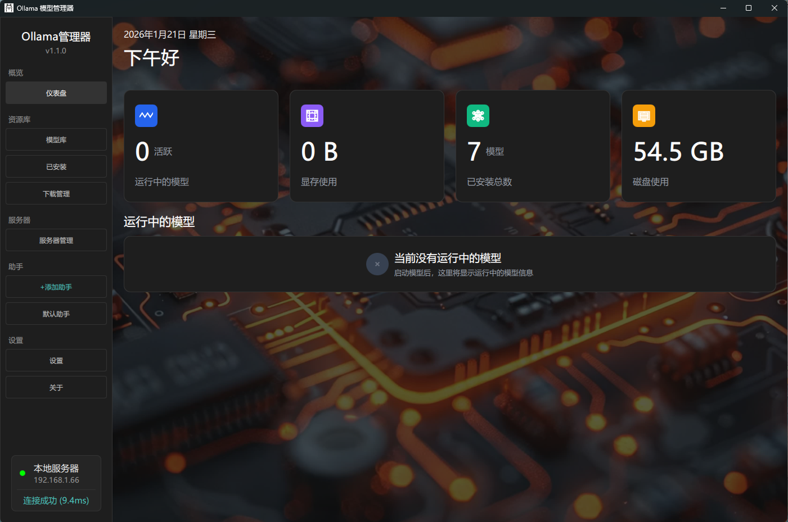

# Ollama 模型管理器

一个基于 PyQt6 和 QML 的 Ollama 模型管理工具，提供图形化界面来管理本地和远程 Ollama 服务器上的模型。

## 功能特性

- **仪表盘**: 查看系统概览，包括活跃模型数、磁盘使用、显存使用等
- **模型管理**: 本地模型的增删改查，支持模型更新和卸载
- **模型库**: 浏览 Ollama 官方模型库，支持搜索和分页
- **模型详情**: 查看模型的详细信息、版本列表和描述
- **模型版本**: 查看模型的所有可用版本
- **下载管理**: 管理模型下载任务，支持暂停、恢复、取消操作
- **服务器管理**: 管理多个 Ollama 服务器，支持连接测试和切换
- **翻译功能**: 支持 Google 翻译和 Ollama 本地模型翻译
- **设置管理**: 管理应用设置，包括翻译配置等
- **深色标题栏**: Windows 平台支持深色标题栏

## 项目结构

```
Ollama Manager/
├── src/                      # 源代码目录
│   ├── __init__.py          # 版本信息
│   ├── main.py              # 应用入口
│   ├── model_manager.py     # 模型管理核心逻辑
│   └── dark_title_bar.py    # Windows 深色标题栏支持
├── ui/                       # 用户界面目录
│   ├── main.qml             # 主界面
│   ├── components/          # UI组件
│   │   ├── NavBar.qml
│   │   └── ModelManager/
│   │       ├── Delegate.qml
│   │       └── ModelManagerPage.qml
│   ├── pages/               # 页面
│   │   ├── DashboardPage.qml        # 仪表盘
│   │   ├── ModelLibraryPage.qml     # 模型库
│   │   ├── ModelDetailPage.qml      # 模型详情
│   │   ├── ModelAllVersionsPage.qml # 模型所有版本
│   │   ├── DownloadManagerPage.qml  # 下载管理
│   │   ├── ServerManagerPage.qml    # 服务器管理
│   │   ├── SettingsPage.qml         # 设置
│   │   ├── AboutPage.qml            # 关于
│   │   ├── AddAssistantPage.qml    # 添加助手（开发中）
│   │   └── DefaultAssistantPage.qml # 默认助手（开发中）
│   ├── utils/               # 工具函数
│   │   └── Utils.js
│   └── assets/              # 资源文件
│       ├── img/             # 图片
│       └── fonts/          # 字体
├── config/                   # 配置文件目录（运行时自动创建）
│   ├── server.json          # 服务器配置
│   ├── download_tasks.json  # 下载任务
│   └── config.json          # 应用设置
├── tests/                    # 测试目录（待实现）
├── docs/                     # 文档目录（待实现）
├── requirements.txt           # Python依赖
├── ollama.png                # 应用图标
└── README.md                 # 项目说明文档
```

## 安装说明

### 环境要求

- Python 3.8+
- PyQt6
- requests
- beautifulsoup4
- lxml

### 安装步骤

1. 克隆或下载项目
2. 创建虚拟环境（推荐）
   ```bash
   python -m venv .venv
   .venv\Scripts\activate
   ```
3. 安装依赖
   ```bash
   pip install -r requirements.txt
   ```
4. 运行应用
   ```bash
   python src/main.py
   ```

## 使用说明

### 首次使用

1. 启动应用后，默认连接到本地 Ollama 服务器（localhost:11434）
2. 在"仪表盘"页面查看系统状态
3. 在"模型库"页面浏览并下载模型
4. 在"下载管理"页面查看下载进度
5. 在"服务器管理"页面添加和管理多个服务器

### 主要功能

#### 模型管理
- 查看已安装的模型列表
- 查看模型详细信息（参数量、文件大小、量化方式等）
- 更新模型到最新版本
- 删除不需要的模型

#### 模型下载
- 从 Ollama 官方模型库浏览和搜索模型
- 查看模型详情和版本信息
- 查看模型的所有可用版本
- 添加模型到下载队列
- 暂停、恢复、取消下载任务
- 查看下载进度、速度和预估时间
- 支持断点续传

#### 服务器管理
- 添加多个 Ollama 服务器
- 测试服务器连接状态和延迟
- 切换活跃服务器
- 编辑和删除服务器配置

#### 翻译功能
- 支持 Google 翻译
- 支持 Ollama 本地模型翻译
- 翻译缓存机制，提高翻译效率
- 可自定义翻译提示词

#### 设置管理
- 管理翻译设置
- 选择翻译方式（Google/Ollama）
- 配置 Ollama 翻译模型和提示词

## 配置说明

配置文件位于 `config/` 目录（首次运行时自动创建）：

- `server.json`: 服务器配置，包括服务器地址、端口和服务器列表
- `download_tasks.json`: 下载任务配置，保存下载任务状态
- `config.json`: 应用设置，包括翻译配置等

## 开发说明

### 项目依赖

- **PyQt6**: Qt6 的 Python 绑定，用于构建 GUI
- **QML**: Qt 声明式语言，用于描述用户界面
- **requests**: HTTP 请求库，用于与 Ollama API 通信
- **beautifulsoup4**: HTML 解析库，用于爬取 Ollama 官方模型库

### 代码结构

- **src/main.py**: 应用入口，初始化 QML 引擎和加载界面
- **src/model_manager.py**: 核心业务逻辑，处理所有 API 调用和数据管理
- **src/dark_title_bar.py**: Windows 平台深色标题栏支持
- **src/__init__.py**: 版本信息定义
- **ui/**: QML 界面文件，使用 Qt Quick 构建 UI

## 常见问题

### 无法连接到 Ollama 服务器

1. 确认 Ollama 服务已启动
2. 检查服务器地址和端口配置
3. 使用"服务器管理"页面的连接测试功能

### 下载失败

1. 检查网络连接
2. 确认模型名称正确
3. 查看"下载管理"页面的错误信息

### 模型卸载失败

当前版本的模型卸载功能使用 `/api/generate` 端点，可能不是最优方案。建议使用官方 Ollama CLI 进行卸载。

## 许可证

本项目采用 MIT 许可证。

## 贡献

欢迎提交 Issue 和 Pull Request！

## 更新日志

### v1.1.0 (2026-01-21)
- 新增模型所有版本查看功能
- 新增翻译功能（支持 Google 翻译和 Ollama 本地翻译）
- 新增设置管理功能
- 新增关于页面
- 新增 Windows 深色标题栏支持
- 优化下载管理，支持断点续传
- 新增服务器连接延迟测试
- 新增活跃模型详细信息显示
- 新增磁盘和显存使用情况显示
- 优化翻译缓存机制

### v1.0.0 (2026-01-20)
- 初始版本发布
- 实现基本的模型管理功能
- 实现模型库浏览和下载功能
- 实现服务器管理功能
- 实现仪表盘功能

## 联系方式

如有问题或建议，请通过 GitHub Issues 联系。
